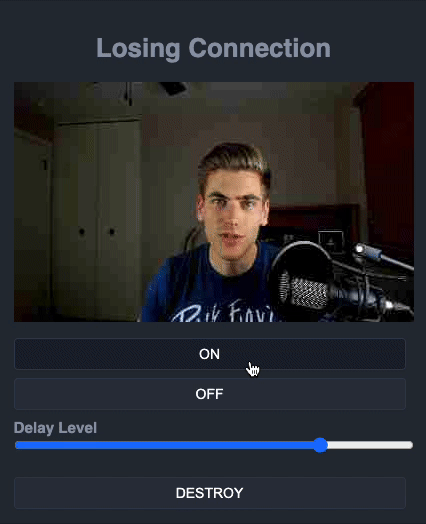

# Pixi Losing Connection Effect

> AKA Zoom Escaper

Simulate Losing Connection Effect from pixijs



# Install

```shell
# npm
npm install pixi-losing-connection-effect

# yarn
yarn add pixi-losing-connection-effect
```

# Usage

```typescript
import { LosingConnection } from "pixi-losing-connection-effect";

const app = new Application({
  // **
});

const LC = new LosingConnection(app, 75);
LC.start();

//  change the dealy level 1-100
LC.delay = 90;

//  stop the effect
LC.stop();

//  start the effect
LC.start();

//  destroy
LC.destroy();
```

# Demo

```shell
# clone this repository
$ git clone https://github.com/carl-jin/pixi-losing-connection-effect.git

$ cd pixi-losing-connection-effect

$ yarn install

$ yarn serve
```

# License

This project is licensed under the MIT License.
